<div align="center">

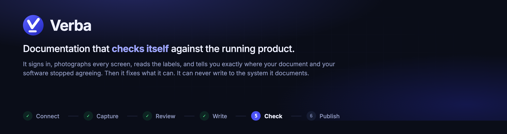

<br>

[](https://github.com/GiladBronshtein/verba/actions/workflows/check.yml)
[](https://www.python.org/)
[](LICENSE)
[](#what-it-can-never-do-to-your-system)

**[Two minutes](#two-minutes) &middot; [What it does](#what-it-does) &middot; [See it](#see-it) &middot; [Safety](#what-it-can-never-do-to-your-system) &middot; [Try the demo](#try-it-yourself) &middot; [Wiki](https://github.com/GiladBronshtein/verba/wiki)**

</div>

---

## Every manual starts accurate and quietly stops

A column gets renamed. A tab disappears. A button loses its label. Nothing in
the document knows. The screenshots are the worst of it: they age silently, and
a reader trusts a picture more than a paragraph.

The usual answers are discipline, which fails, or a rewrite every quarter, which
is expensive and still wrong by the time it ships.

**Verba treats the running system as the source of truth**, and the document as
something to be held against it, continuously, by a process that does most of
the work without asking.

<br>

<div align="center">
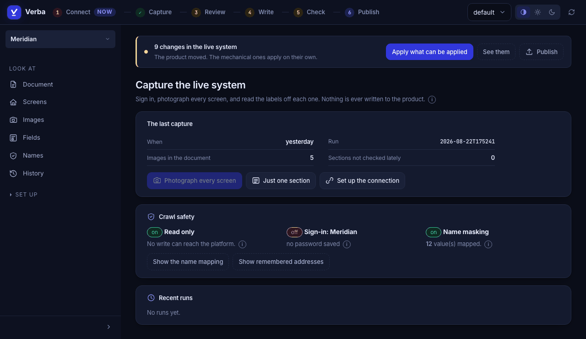
<br><sub>The console, running against the demo product that ships with this repo.</sub>
</div>

---

## Two minutes

```bash
pip install "git+https://github.com/GiladBronshtein/verba.git#egg=verba-docs[assist]"
playwright install chromium

verba new my-docs        # six questions, every one with a default
cd my-docs
verba build --pdf        # you already have a document
verba console            # and this is where you work
```

`verba new` writes a project that **builds immediately**: a real first section,
a screen registry, a theme. The first thing you meet is a PDF, not an error
about a rule you have not read.

---

## What it does

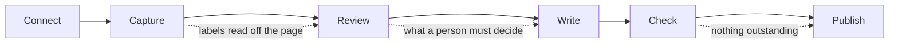

That sequence is the interface. Each step carries its own state, the one with
work in it is marked, and every step stays clickable: someone who wants Publish
on a Tuesday is working, not lost.

### The loop

| | |
|---|---|
| **Crawl a live system** | Signs in, walks every screen, photographs it at a fixed viewport, reads the labels off the page |
| **Wait for you, when it must** | Two-factor, a prompt on your phone, a hardware key: a browser opens, Verba fills what it knows, you finish, and the crawl carries on by itself |
| **Detect drift** | Compares those labels with what your sections claim. Renames are detected as renames, not a deletion plus an addition |
| **Fingerprint screenshots** | A changed screen is flagged even when no label moved |
| **Fix what can be fixed** | Applies mechanical changes, writes missing descriptions from evidence, rewrites what the rules object to, adopts fresh pictures |
| **Measure and revert** | Every step is applied, the rules counted again, and anything that made the document worse put straight back |
| **Hand back only decisions** | What it cannot justify from evidence comes back with the reason and the choice |

### What the model does

A model is configured for the writing, and used for everything it is actually
good at, not just prose.

| | |
|---|---|
| **Writes missing descriptions** | From the crawl evidence, leaving a marker rather than inventing a meaning the evidence does not support |
| **Rewrites to house style** | Triggered by the rule findings that name a rewrite as their fix |
| **Reads each section against the crawl** | Not label to label: does what this section *says* survive contact with the screen, and does it omit what the screen is for |
| **Looks at every picture** | Checks each screenshot for real customer names, against the exact list of strings that must never appear |
| **Checks each picture is of the right thing** | A chapter called *Dashboard Overview* illustrated by the accounts list passes every other rule |
| **Decides the residue** | From a closed menu: repoint a figure at the right picture, drop one that cannot be published, or say plainly that this one is yours |

Every model action is measured like any other change, judged one at a time, and
recorded in History with its reasoning. **No rewrite may drop a figure**: a
model asked about labels is not being asked whether the section should have
pictures.

### Safety

| | |
|---|---|
| **Does not write to your system** | Enforced in the browser. Every non-GET aborted, except during the sign-in you asked for, and every one of those recorded |
| **Masks real names** | Rewrites customer names and identifiers in the DOM immediately before each screenshot |
| **Stable placeholders** | One real value always becomes the same placeholder, so figures never contradict each other |
| **Refuses unmasked production** | A connection marked as holding real data cannot be captured unmasked |
| **Closes the one open window** | While you finish a sign-in yourself, writes are permitted. That ends the instant the product appears, not at the end of the crawl |
| **Locked, atomic writes** | Two consoles cannot lose each other's work |
| **Everything reversible** | Every change is in History, by whom, with a diff and a restore |
| **Verified means a person** | An acceptance names who made it and the crawl they read it against, and no automated step can produce one |
| **A ceiling on model calls** | Every run is capped and counted, so a loop stuck in a circle stops rather than billing until somebody notices |

### The document

| | |
|---|---|
| **DOCX, PDF and HTML** | One content tree, three outputs |
| **Derived numbering** | Section files carry no number, so inserting one renumbers the body and the contents page together |
| **Editions** | One tree, several documents. An edition declares what it carries |
| **Themes** | Five, each contrast-measured rather than eyeballed |
| **Page setup** | Paper, margins, alignment, hyphenation, figure width, contents depth. PDF and Word read the same numbers |
| **Versioned releases** | `release --version v2` refuses to overwrite an output |

---

## See it

<table>
<tr>
<td width="50%">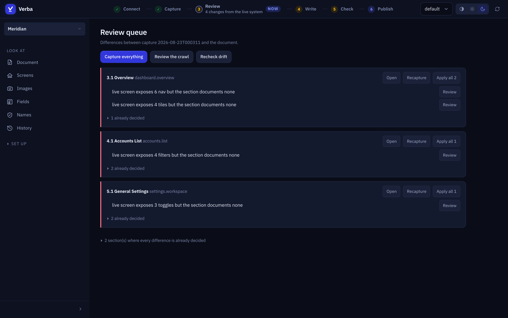<br>
<sub><b>Review</b>: every difference between the last crawl and the
document, with Apply where the change is mechanical.</sub></td>
<td width="50%">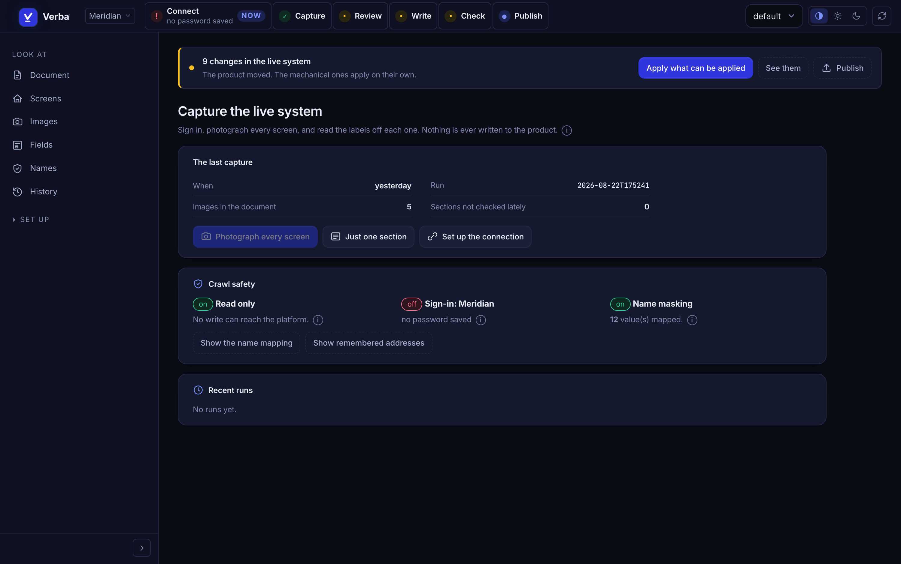<br>
<sub><b>Capture</b>: what the last crawl found, the read-only guarantees,
and screens photographed that no section shows.</sub></td>
</tr>
<tr>
<td width="50%">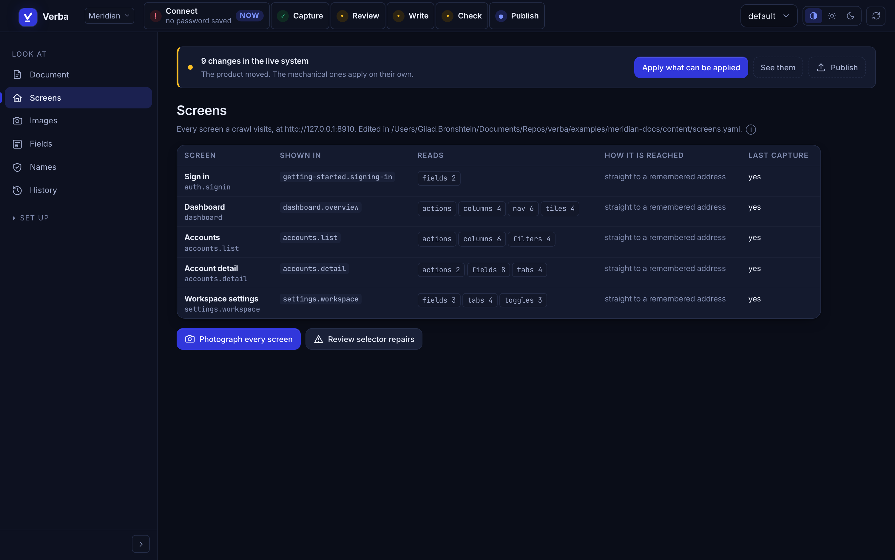<br>
<sub><b>Screens</b>: what gets photographed and what is read off each one.
Reports screens that read nothing and so can never detect a change.</sub></td>
<td width="50%">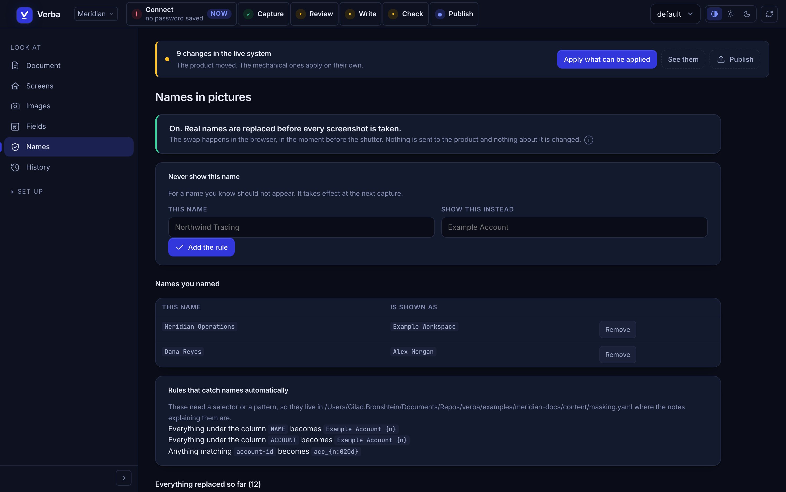<br>
<sub><b>Names</b>: which real names must never appear, every replacement
made so far, and any picture nobody has checked.</sub></td>
</tr>
<tr>
<td width="50%">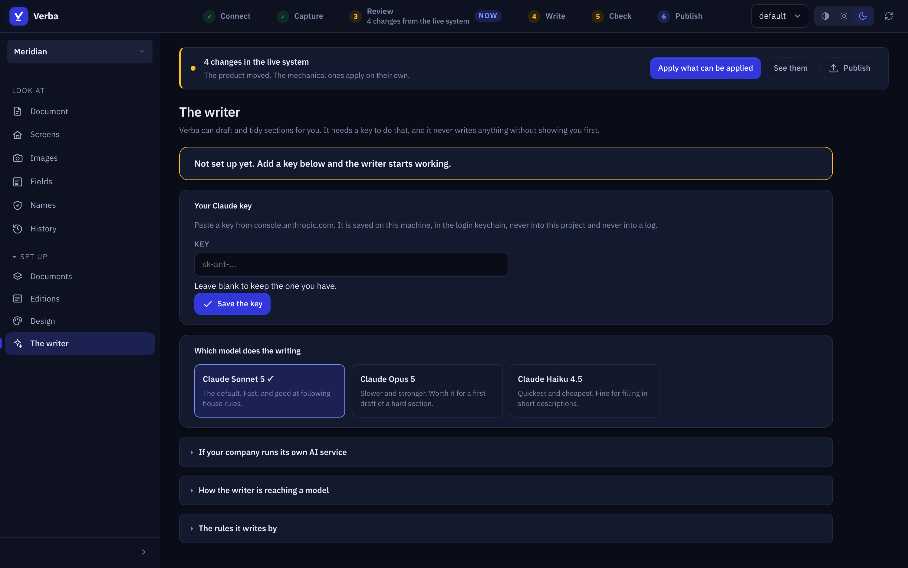<br>
<sub><b>The writer</b>: paste a key, pick a model by what it is good at.
Gateway settings fold away for the people who have one.</sub></td>
<td width="50%">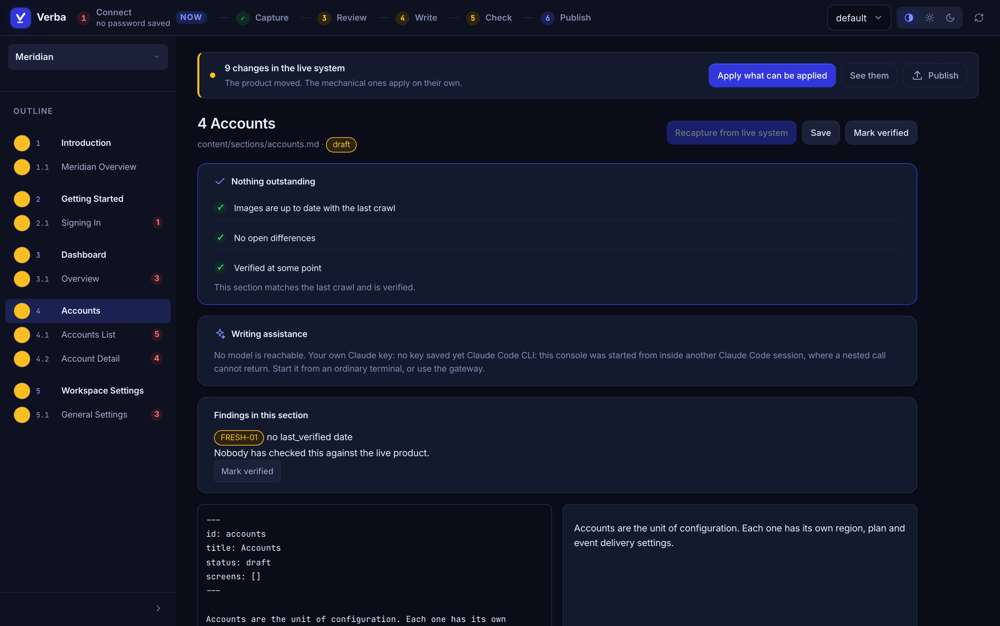<br>
<sub><b>A section</b>: the outline down the side, what is outstanding, the
source and its preview. Recapture just this screen from here.</sub></td>
</tr>
</table>

<details>
<summary><b>More of the console</b>: editions, design, documents, light mode</summary>
<br>
<table>
<tr>
<td width="50%">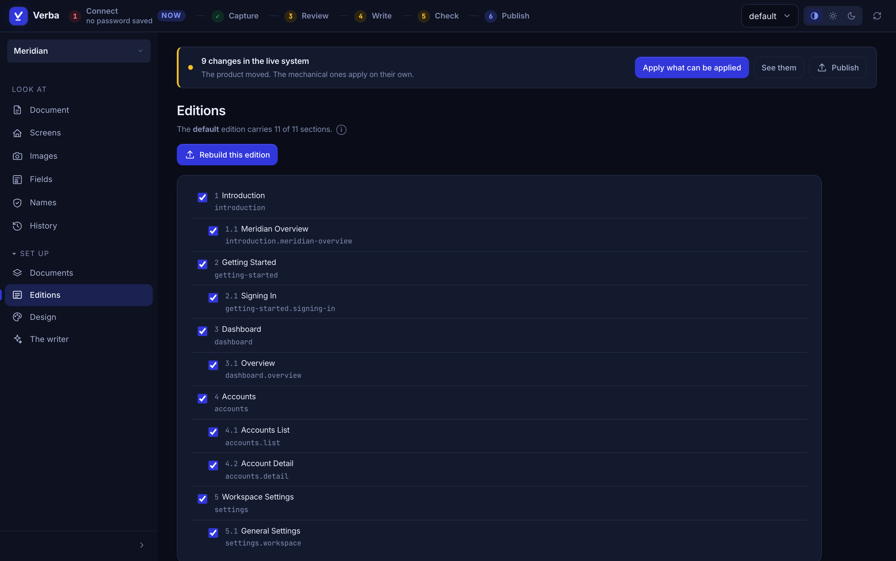<br>
<sub><b>Editions</b>: what each edition carries. Drop a chapter and the
numbering closes up behind it.</sub></td>
<td width="50%">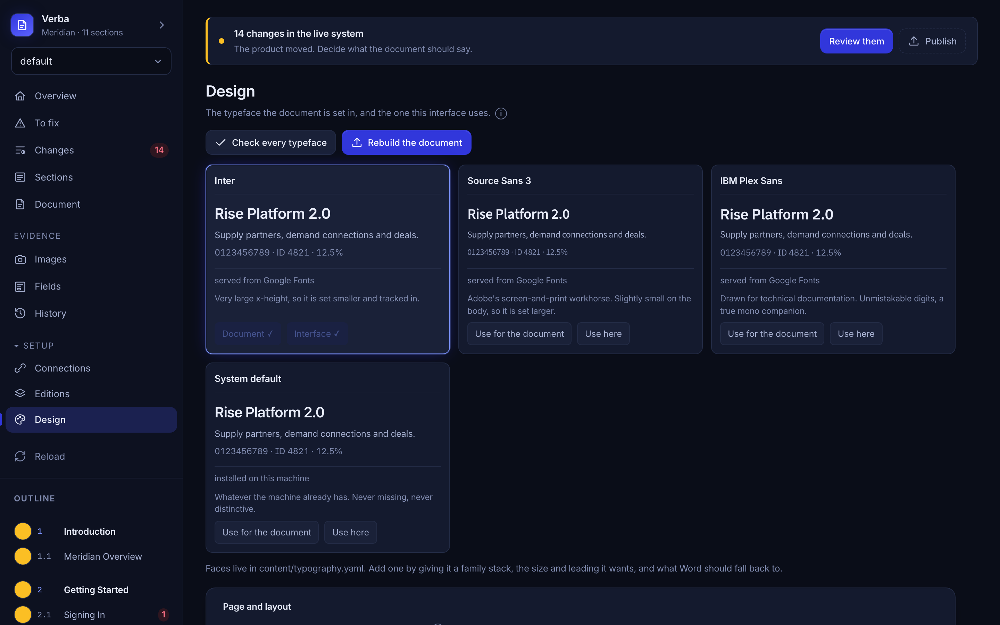<br>
<sub><b>Design</b>: palette, typeface, sheet and margins.</sub></td>
</tr>
<tr>
<td width="50%">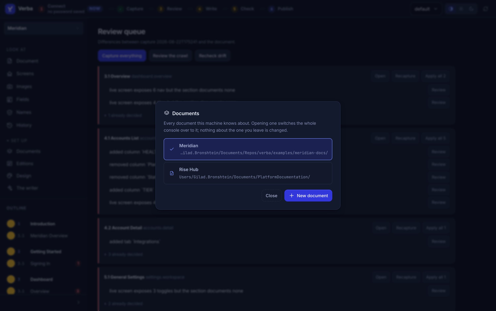<br>
<sub><b>Documents</b>: every system you document, in one console.</sub></td>
<td width="50%">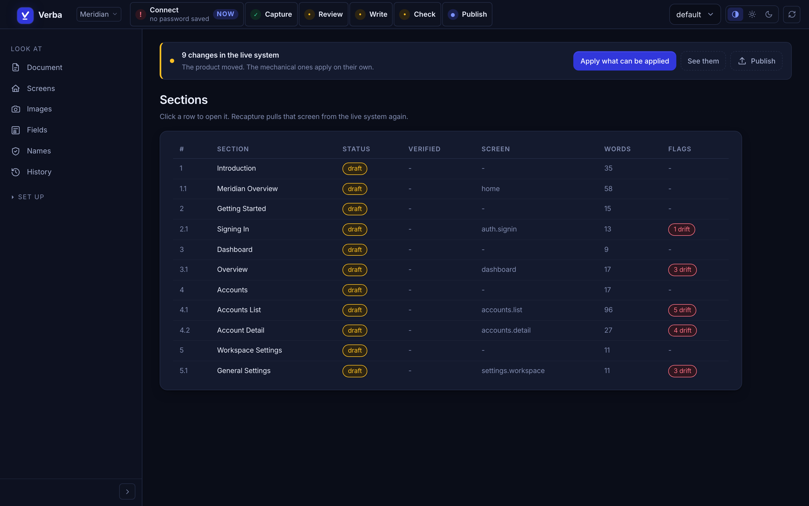<br>
<sub><b>Sections</b>: status, freshness, the screen each is evidenced by.</sub></td>
</tr>
</table>
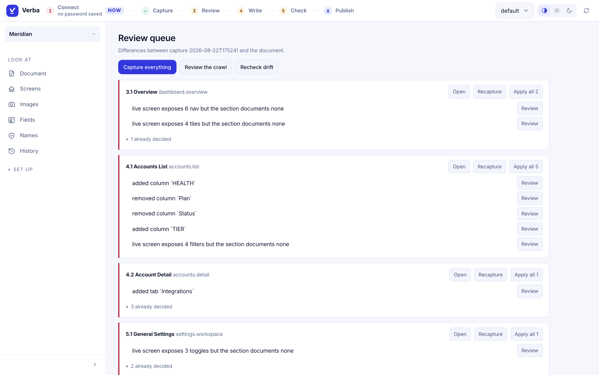
<sub>Both themes are real, and both measured: every text colour checked against
the background it is actually painted on.</sub>
</details>

### And what comes out

<table>
<tr>
<td width="50%">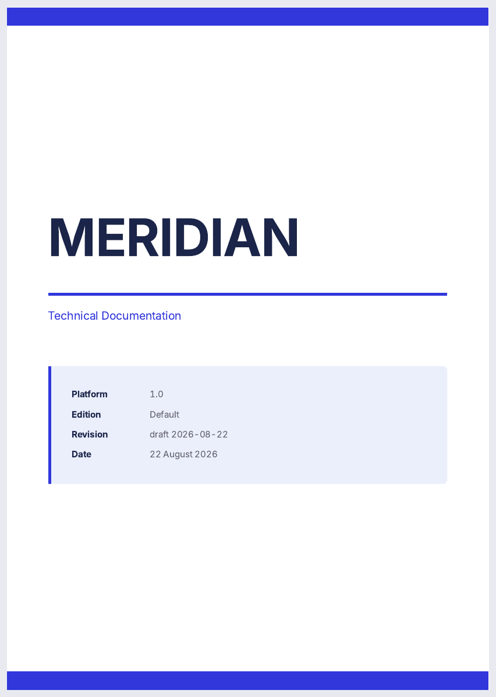</td>
<td width="50%">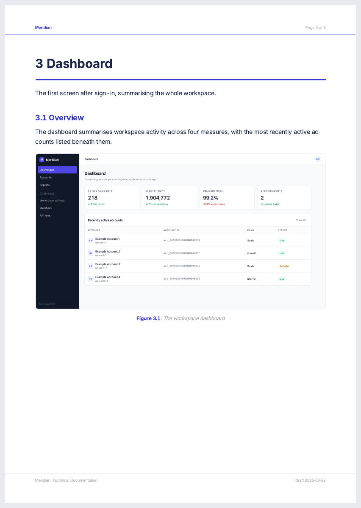</td>
</tr>
</table>

---

## Drift is a queue, not a discovery

Each screen declares what to read off it. After a crawl those labels are
compared with what your sections claim.

```diff
  ### 4.1 Accounts List
+ added column `HEALTH`
- removed column `Plan`
+ added column `TIER`

  ### 4.2 Account Detail
+ added tab `Integrations`
```

High confidence items apply on their own. Anything needing judgement says so
instead of offering a button.

## A capture proves a control exists. It does not prove what it means.

So the writer is told to leave `TODO: describe this.` rather than invent a
plausible purpose from a button's name, and the marker is refused at build time
so it can never ship. **Confident, fluent and wrong is the worst failure a
documentation tool has.**

What the product actually *is* comes from a person, once, in
`content/system.md`, given to the model ahead of the writing rules:

```markdown
## Vocabulary
- **Publisher** : an account that supplies inventory. Never "seller".
- **Connection** : one route to a demand partner. A partner may have several.

## Rules that are true of this system
- A connection inherits its floor price from the partner unless it sets its own.
- Blocklists combine by union, so the most restrictive setting wins.
```

The writing rules themselves live in `content/house.md` when you want your own,
and fall back to a built-in set when you do not. A team that documents route
paths on purpose can say so.

---

## What it can never do to your system

The guarantee everything else rests on, and it is enforced in code rather than
in a promise.

Every non-GET request is aborted in the browser. There are exactly two windows
where one is permitted, and both are yours: the sign-in itself, and, with
`auth: handoff`, the seconds while **you** finish that sign-in at the keyboard.
Both are recorded request by request in the run manifest, and the second closes
the instant the product appears rather than when the crawl ends.

That is a smaller claim than "never", and it is one you can check. An absolute
with a footnote is worth less than a limit that is true.

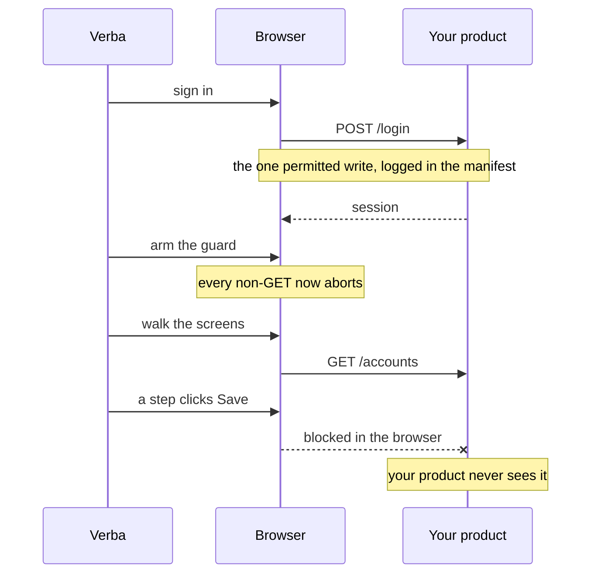

Two further layers sit on top. The step interpreter refuses `fill` outside
sign-in and refuses Enter presses, so no form can be completed. The screen
registry is linted before every crawl for steps that read like a commit.

Verified by a test that stands up a server which records what it receives,
drives a real browser at it with the guard armed, and clicks a button wired to a
`PUT`:

```
blocked write: PUT http://127.0.0.1:8899/api/accounts/1
```

The server's write log contained only the sign-in POST. **The test fails if the
guard is removed**, which was checked.

## Screenshots that do not leak your customers

Rules rewrite real values in the page's DOM immediately before each screenshot.

```yaml
columns:
  - header: NAME
    with: "Example Account {n}"
    as: account
patterns:
  - name: account-id
    pattern: "acc_[0-9a-f]{20}"
    with: "acc_{n:020d}"
```

Column rules catch every name in a list view without knowing the names in
advance, which matters because the data changes between crawls. A name learned
from a column is masked everywhere else on the page too, and the mapping is
stored, so one real value always becomes the same placeholder.

Masking protects what a crawl takes and says nothing about a picture that
arrived some other way. Those are found, reported, and looked at.

## When signing in needs a human

Plenty of products ask for something a machine cannot produce: a one-time code,
a prompt on a phone, a hardware key. Those used to be the end of the crawl.

```yaml
  - id: production
    auth: handoff
    user: docs@example.com     # optional
```

A browser opens, Verba fills in the boring half, and then **stops and waits for
you**. The moment the product is on screen the crawl carries on by itself, in
the same run, and the session is saved so nobody is asked twice.

```
  over to you: finish signing in in the browser window,
  including any code, prompt or key. The crawl carries on
  by itself the moment the product is on screen.
    waiting for you to sign in, 4m 58s left
    signed in
  session saved, the next crawl will not ask (production.json)
read-only guard armed: writes are blocked from here on
  captured accounts.list in 1.1s via steps  [columns=6]
```

For one run on a connection you have not changed yet:

```bash
verba capture --wait-for-signin
```

An expired session asks rather than fails, and a login step that breaks because
the product just started asking for a code hands over rather than stopping: that
is exactly the case a person is there for.

The window while you are driving is the one time writes are permitted, and it
closes when the product appears rather than when the crawl ends. There is a test
that stands up a server insisting on a code, plays the person, and then checks
the server received nothing.

---

## Editions

One content tree, several documents. An edition declares what it carries, so
"what is in the customer edition" is one list you can read rather than a
property scattered across every section file.

```yaml
# content/profiles/acmecorp.yaml
name: acmecorp
title_suffix: " (AcmeCorp Edition)"
sections:
  exclude: [admin-tools]      # drops the branch; numbering closes up
vars:
  operator:
    name: AcmeCorp
```

Sections write `{{ operator.name }}` rather than naming a company. A neutral
edition is held to that automatically: the names it must not print are read off
your *other* editions.

## Design is a setting, not a fork

```bash
verba themes --use ink
verba themes --check
verba layout --paper Letter --side 20 --align justify --figure-width 14
```

Every layout change is judged before any of it is written, against the page you
are choosing rather than the one on disk:

```
refused: a 15cm figure does not fit the 11.2cm column on A5 at 18mm margins
```

## When a selector breaks

```bash
verba capture --heal
verba heal --apply
```

The crawler snapshots what the page actually offers, asks a model for a
replacement, and **verifies that answer in the live page before believing it**.
A selector that matches nothing is never proposed. Repairs are proposals,
because a selector that resolves is not necessarily the right one.

---

## Try it yourself

Everything above came from a demo that ships with this repository: a small
fictional admin console called Meridian, and a document built from it. Nothing
points at anyone's real system.

```bash
git clone https://github.com/GiladBronshtein/verba.git && cd verba
pip install -e ".[assist]" && playwright install chromium

python3 examples/meridian/serve.py &            # the product being documented
export VERBA_USER=ops@meridian.test VERBA_PASSWORD=anything

verba --root examples/meridian-docs capture     # photograph it
verba --root examples/meridian-docs build --pdf
verba --root examples/meridian-docs console     # and look at it
```

To watch drift appear, change Meridian: rename a column in
`examples/meridian/serve.py`, restart it, and capture again.

## Commands

| Command | What it does |
|---|---|
| `verba new` | start a new document, without a blank page |
| `verba console` | the management interface, and the easiest way in |
| `verba status` | every section with status, freshness and open drift |
| `verba capture` | crawl the live system into a timestamped run |
| `verba capture --wait-for-signin` | wait while you sign in, second factor and all |
| `verba drift` | compare the newest capture to the document |
| `verba fix` | settle everything the system can, and say what is left |
| `verba fix --full` | photograph every screen first, then do that |
| `verba auto` | the whole loop, stopping only where you are needed |
| `verba accept` | walk the unsigned sections and sign them, one at a time |
| `verba lint` | run the content rules |
| `verba build --pdf` | render DOCX, PDF and the HTML preview |
| `verba release --version v2` | cut a version, never overwriting an output |
| `verba themes` / `verba layout` | how the document looks, how the page is set |
| `verba edition` | which sections this edition carries |
| `verba survey` | what the document is missing, before you crawl |
| `verba masking` | the real-to-placeholder mapping |
| `verba heal` | review the selector repairs a crawl proposed |

## Reaching a model

Three routes, tried in order, and the console names whichever it is using:

1. **Your organisation's AI service.** Verba asks it what models it carries and
   offers you those, rather than guessing at a list.
2. **Your own Claude key,** pasted into the console, kept in the OS keychain,
   never in the project and never in a log.
3. **The Claude Code CLI,** which needs no key. It cannot be given an image, so
   the picture checks need one of the first two.

This speaks the Anthropic Messages API. Claude works directly, and a gateway can
translate for models that do not: on one real deployment the picker offered
twelve models including GPT variants, and they answer.

## Requirements

- Python 3.11 or newer
- Chromium, via `playwright install chromium`
- `pip install "verba-docs[assist]"` for the writing and the picture checks

Credentials never live in the repository. A form login keeps its password in the
OS keychain or in `VERBA_PASSWORD` for scheduled runs; single sign-on keeps a
saved browser session and no password at all.

## Tests

```bash
python tools/selftest.py
```

The suite builds a project from scratch with the wizard and tests the engine
against *that*, rather than a hand-made fixture. An engine whose whole claim is
that it works on a product it has never seen should be tested that way.

It runs on every push, with a browser, against the demo document. The first
three things CI found were that the package did not build, that `numpy` was
imported and never declared, and that a duplicate dictionary key had been
silently discarding every section's own note.

## Documentation

The [wiki](https://github.com/GiladBronshtein/verba/wiki) is the long form, and
**[Features](https://github.com/GiladBronshtein/verba/wiki/Features)** is
everything it does in one list.

| | | |
|---|---|---|
| [Features](https://github.com/GiladBronshtein/verba/wiki/Features) | [Installation](https://github.com/GiladBronshtein/verba/wiki/Installation) | [Your first document](https://github.com/GiladBronshtein/verba/wiki/Your-first-document) |
| [The loop](https://github.com/GiladBronshtein/verba/wiki/The-loop) | [Console guide](https://github.com/GiladBronshtein/verba/wiki/Console-guide) | [Project layout](https://github.com/GiladBronshtein/verba/wiki/Project-layout) |
| [Sections](https://github.com/GiladBronshtein/verba/wiki/Sections) | [Screens registry](https://github.com/GiladBronshtein/verba/wiki/Screens-registry) | [Connections and sign in](https://github.com/GiladBronshtein/verba/wiki/Connections-and-sign-in) |
| [Masking and names](https://github.com/GiladBronshtein/verba/wiki/Masking-and-names) | [Editions](https://github.com/GiladBronshtein/verba/wiki/Editions) | [Themes and layout](https://github.com/GiladBronshtein/verba/wiki/Themes-and-layout) |
| [The writer](https://github.com/GiladBronshtein/verba/wiki/The-writer) | [The read only guarantee](https://github.com/GiladBronshtein/verba/wiki/The-read-only-guarantee) | [Healing selectors](https://github.com/GiladBronshtein/verba/wiki/Healing-selectors) |
| [Rule reference](https://github.com/GiladBronshtein/verba/wiki/Rule-reference) | [CLI reference](https://github.com/GiladBronshtein/verba/wiki/CLI-reference) | [Architecture](https://github.com/GiladBronshtein/verba/wiki/Architecture) |
| [Troubleshooting](https://github.com/GiladBronshtein/verba/wiki/Troubleshooting) | [FAQ](https://github.com/GiladBronshtein/verba/wiki/FAQ) | [Contributing](https://github.com/GiladBronshtein/verba/wiki/Contributing) |

Its source is `docs/wiki/` in this repository, so wiki pages are reviewed in
pull requests like anything else and published with `tools/publish-wiki.sh`.

## Contributing

See [CONTRIBUTING.md](CONTRIBUTING.md). Two rules there are not style
preferences: **nothing may write to the system being documented**, and **nothing
decides what a person owns**.

## License

MIT.
