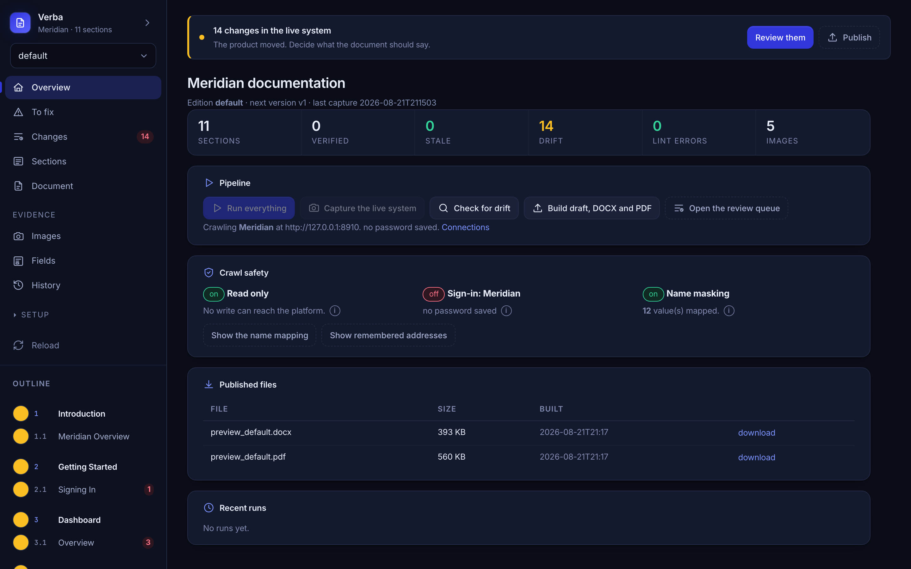

<div align="center">


# Verba

**Technical documentation built from the running system, not from memory.**

Point it at your product. It signs in, photographs every screen, reads the real
labels off the page, and tells you exactly where your documentation and your
software have drifted apart. Then it builds a DOCX, a PDF and an HTML preview
from one content tree.

It can never write to the system it documents. That is enforced in the browser,
not by being careful.

[](https://www.python.org/)
[](LICENSE)
[](https://github.com/GiladBronshtein/verba/actions/workflows/check.yml)
[](tools/selftest.py)
[](#nothing-is-ever-written-to-the-system-you-document)

</div>

---


<div align="center"><sub>
The review queue after the product changed underneath the document.<br>
Everything in this README was produced by the demo in <a href="#try-it-in-two-minutes">two minutes</a>, and you can reproduce all of it.
</sub></div>

---

## The problem

Every product manual starts accurate and then quietly stops being accurate. A
column gets renamed, a tab disappears, a button loses its label, and nothing in
the document knows. The screenshots are the worst of it: they age silently, and
a reader trusts a picture more than a paragraph.

The usual answer is discipline, which fails, or a rewrite every quarter, which
is expensive and still wrong by the time it ships.

Verba treats the running system as the source of truth and the document as
something to be held against it.

## Two minutes

```bash
pip install git+https://github.com/GiladBronshtein/verba.git
playwright install chromium

verba new my-docs        # six questions, every one with a default
cd my-docs
verba build --pdf        # you already have a document
verba console            # and this is where you work
```

> Not on PyPI yet, so install from the repository. The name `verba-docs` is
> reserved for when it is.

`verba new` writes a project that **builds immediately** — a real first section,
a real screen registry, a theme — so the first thing you meet is a PDF rather
than an error about a rule you have not read yet.

---

## What it looks like



One line at the top of every view says what is worth doing now and why. Eleven
views of true statements leave a reader to work out which one is their move; a
document is a piece of work with an order to it, and the interface should know
that order.

<table>
<tr>
<td width="50%"><br>
<sub><b>Sections</b> — every section with its status, freshness, the screen it
is evidenced by, and what is flagged against it.</sub></td>
<td width="50%"><br>
<sub><b>Editions</b> — what each edition of the document carries. Drop a chapter
and the numbering closes up behind it.</sub></td>
</tr>
<tr>
<td width="50%"><br>
<sub><b>Design</b> — the typeface, the sheet, the margins, how text is set. The
PDF and the Word file read the same numbers.</sub></td>
<td width="50%"><br>
<sub><b>Documents</b> — every system you document, in one console. Switch
between them, or start another.</sub></td>
</tr>
</table>

Both themes are real, and both are measured: every text colour is checked
against the background it is actually painted on, not against an assumed one.

<details>
<summary>The same screen in light mode</summary>

</details>

## What it produces

<table>
<tr>
<td width="50%"></td>
<td width="50%"></td>
</tr>
</table>

DOCX, PDF and a browsable HTML preview, from one content tree. Numbering,
the contents page and figure numbers are all derived: section files never
contain a number, so inserting a section renumbers everything below it, in the
body and on the contents page together. Hand-numbered documents always
eventually disagree with their own contents page. This one cannot.

---

## Drift is a queue, not a discovery

Each screen declares what to read off it. After a crawl, those labels are
compared with what your sections claim.

```
### 4.1 Accounts List
- [!] added column `OWNER`

### 4.2 Account Detail
- [!] removed tab `Audit log`
- [!] added tab `Configuration`
- [!] removed tab `Settings`
```

`[!]` is high confidence, `[?]` needs judgement. Renames are detected as
renames rather than reported as an unrelated deletion plus an addition.
Mechanical changes apply with one click; anything needing a decision says so
instead of offering a button.

Screenshots are compared by fingerprint too, so a screen that changed is flagged
even when no label moved.

## A capture proves a control exists. It does not prove what it means.

So the writer is told to leave `TODO: describe this.` rather than invent a
plausible purpose from a button's name. Confident, fluent and wrong is the worst
failure a documentation tool has, and the marker is refused at build time, so it
can never ship.

What the product actually *is* comes from a person, once, in
`content/system.md`. It is handed to the model ahead of the writing rules, and
it wins where they disagree.

```markdown
## Vocabulary

- **Publisher** : an account that supplies inventory. Never "seller".
- **Connection** : one route to a demand partner. A partner may have several.

## Rules that are true of this system

- A connection inherits its floor price from the partner unless it sets its own.
- Blocklists combine by union, so the most restrictive setting wins.

## Do not document

- Internal identifiers, API routes and developer-facing values.
```

---

## Nothing is ever written to the system you document

This is the guarantee everything else rests on, and it is enforced in code.

As soon as sign-in finishes, a route handler in the browser aborts every request
whose method is not `GET`, `HEAD` or `OPTIONS`. A stray click on Save fires its
request and the request dies in the browser: your product never sees it. Sign-in
is the single permitted write, and every sign-in request is logged and reported
in the capture manifest, so the one exception stays auditable.

Two further layers sit on top. The step interpreter refuses `fill` outside
sign-in and refuses Enter presses, so no form can be completed. The screen
registry is linted before every crawl for steps that read like a commit.

Verified end to end against a mock server that records what it receives. A step
that deliberately clicked Save produced

```
blocked write: PUT http://127.0.0.1:8899/api/publishers/1
```

and the server's write log contained only the sign-in POST.

## Screenshots that do not leak your customers

A screenshot of a live account carries one customer's data into another
customer's documentation. Rules rewrite real values in the page's DOM
immediately before each screenshot is taken, and in the labels read off the page
afterwards.

```yaml
columns:
  - header: NAME
    with: "Example Account {n}"
patterns:
  - name: account-id
    pattern: "acc_[0-9a-f]{20}"
    with: "acc_{n:020d}"
```

Column rules matter most: they catch every name in a list view without knowing
the names in advance, which is necessary because the data changes between
crawls. A name learned from a column is masked everywhere else on the page too,
including breadcrumbs, headings and running prose, and the mapping is stored, so
one real value always becomes the same placeholder — in this crawl and in crawls
months from now.

The substitution happens in the browser and nothing is submitted, so this stays
consistent with the guarantee above. A connection can be marked as holding real
data, and capturing it unmasked is then refused outright.

---

## Design is a setting, not a fork

Five built-in themes, every one measured rather than eyeballed: body text at
7:1 and the accent at 4.5:1, checked against the ground each colour is actually
painted on, including its own tinted callout, which is where accents usually
fail.

| | | |
|---|---|---|
| **Slate** | the neutral default | indigo on near-black |
| **Ink** | editorial monochrome | one warm accent, so it means something |
| **Atlas** | engineering register | deep teal and cool grey |
| **Ember** | warm and softer | charcoal with burnt amber |
| **Forest** | calm and unbranded | deep green, low saturation |

```bash
verba themes                 # what is available, and what each is for
verba themes --use ink
verba themes --check         # measure whatever you have set
```

Override single tokens without forking a theme, because most companies have one
brand colour and no opinion about the other nineteen:

```yaml
use: slate
tokens:
  brand_blue: "0F766E"
```

Page setup is a setting too, and the PDF and the DOCX read the same one:

```bash
verba layout --paper Letter --side 20 --align justify --figure-width 14
```

```
sheet          A4  (210 x 297 mm)
side margins   18 mm
top / bottom   29 / 25.3 mm  (edge 12 + band 8 + gap 9)
column         17.4 cm of text
body text      justify, hyphens on
figures        15 cm wide
contents       down to level 3
```

Every change is judged before any of it is written, against the page you are
choosing rather than the one on disk. Moving to A5 and narrowing the figures in
one edit is one coherent change; asking for A5 while keeping 15cm figures is
refused whole, with the reason:

```
refused: a 15cm figure does not fit the 11.2cm column on A5 at 18mm margins
```

## Editions

One content tree, several documents. An edition declares what it carries, so
"what is in the customer edition" is one list you can read rather than a
property scattered across every section file.

```yaml
# content/profiles/acmecorp.yaml
name: acmecorp
title_suffix: " (AcmeCorp Edition)"
sections:
  exclude: [admin-tools]      # drops the branch; numbering closes up
vars:
  operator:
    name: AcmeCorp
```

Sections write `{{ operator.name }}` rather than naming a company. A neutral
edition is held to that automatically: the names it must not print are read off
your *other* editions, so nothing is listed twice.

## Many systems, one console

A document is any folder with a `content/doc.yaml` in it. The console lists the
ones this machine knows about, switches between them, and creates new ones with
the same six questions the command line asks — so documenting a second product
does not mean a second terminal and a second port.

---

## The loop

```
capture  ->  drift  ->  author  ->  lint  ->  build  ->  release
   |          |           |          |         |          |
 live UI   review     section     rules     DOCX +    versioned
 crawl     queue      edits      enforced   preview   output
```

Or hand the whole thing over:

```bash
verba auto
```

It crawls, fills the gaps the evidence can answer, fixes the writing, applies
the mechanical differences, adopts the fresh screenshots, and stops where a
person is genuinely needed. What makes it safe to leave alone is not confidence,
it is measurement: every step is applied, the rules are counted again, and a step
that made the document worse is put straight back.

```
round 2
  fill the gaps the crawl can answer: 5 section(s) written
    reverted 5 change(s), because the rules got worse (0 to 5)
```

Three things it will not do: write to your system, accept a figure from a screen
that landed somewhere else, or decide something a person owns.

## When a selector breaks

Products change and selectors stop resolving. Normally that means a failed crawl
and someone editing YAML against devtools.

```bash
verba capture --heal
verba heal              # review what it proposes
verba heal --apply
```

On a failure the crawler snapshots what the page actually offers, asks a model
for a replacement, and then **verifies that answer in the live page before
believing it**. A selector that matches nothing is never proposed. Repairs are
proposals, reviewed like any other change, because a selector that resolves is
not necessarily the right one.

Two results from testing this with selectors broken on purpose:

- `.legacy-grid-header-cell` was repaired to `table thead th`, verified at five
  matches, and the crawl recovered in the same run.
- A step looking for a button that does not exist was **not** repaired. The
  model replied that the page it had been shown was the list, not the create
  form, and declined. Refusing is the more valuable behaviour of the two.

---

## Try it in two minutes

Everything in this README was produced by a demo that ships with the repository:
a small fictional admin console called Meridian, and a document built from it.
Nothing points at anyone's real system.

```bash
git clone https://github.com/GiladBronshtein/verba.git && cd verba
pip install -e . && playwright install chromium

python3 examples/meridian/serve.py &          # the product being documented
export VERBA_USER=ops@meridian.test VERBA_PASSWORD=anything

verba --root examples/meridian-docs capture   # photograph it
verba --root examples/meridian-docs build --pdf
verba --root examples/meridian-docs console   # and look at it
```

To watch drift appear, change Meridian — rename a column in
`examples/meridian/serve.py`, restart it, and capture again. The rename lands in
the review queue.

## Commands

| Command | What it does |
|---|---|
| `verba new` | start a new document, without a blank page |
| `verba console` | the management interface, and the easiest way in |
| `verba status` | every section with status, freshness and open drift |
| `verba capture` | crawl the live system into a timestamped run |
| `verba drift` | compare the newest capture to the document |
| `verba lint` | run the content rules |
| `verba build --pdf` | render DOCX, PDF and the HTML preview |
| `verba release --version v2` | cut a version, never overwriting an output |
| `verba auto` | the whole loop, stopping only where you are needed |
| `verba themes` | how the document looks |
| `verba layout` | the sheet, the margins, how text is set |
| `verba edition` | which sections this edition carries |
| `verba survey` | what the document is missing, before you crawl |
| `verba masking` | the real-to-placeholder mapping |
| `verba heal` | review the selector repairs a crawl proposed |

## Writing assistance

Five model-backed actions, each returning a **proposal**: a line diff you accept,
open in the editor, or discard. Nothing reaches a section file otherwise, and a
proposal that does not parse as a valid section, or that tries to change a
section id, is rejected before you see it.

The model is reached in this order, and the console names which it is using:

1. **A gateway**, if one is configured — for teams that meter model usage centrally.
2. **The Anthropic API**, if `ANTHROPIC_API_KEY` is set.
3. **The Claude Code CLI**, which needs no key at all.

If none is reachable the panel says so and the rest of the pipeline is
unaffected. `ANTHROPIC_BASE_URL` is deliberately not consulted: it is set per
shell and can point somewhere you did not choose for this pipeline.

## Requirements

- Python 3.11 or newer
- Chromium, via `playwright install chromium`, for capture and PDF

Credentials never live in the repository. A form login keeps its password in the
OS keychain (`verba env password <id>`) or in `VERBA_PASSWORD` for scheduled
runs; single sign-on keeps a saved browser session and no password at all.

## Tests

```bash
python3 tools/selftest.py
```

The suite builds a project from scratch with the wizard and tests the engine
against that, rather than against a hand-made fixture. An engine whose whole
claim is that it works on a product it has never seen should be tested that way.

It runs on every push, with a browser, against the demo document. The first
three things it found were that the package did not build, that `numpy` was
imported and never declared, and that a duplicate dictionary key had been
silently discarding a section's own note.

## License

MIT.
