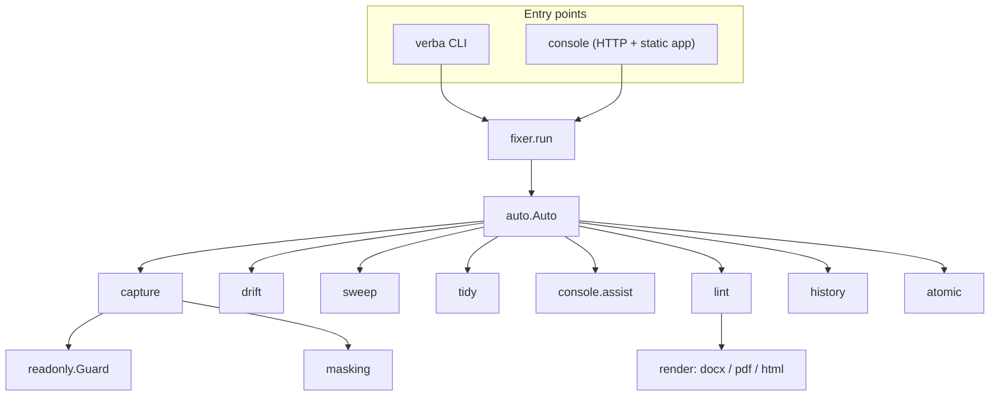

# Architecture

One package, one project directory. The package is code you upgrade; the project
is data you own.



## Modules

| Module | Responsibility |
|---|---|
| `cli.py` | Argument parsing and command dispatch, nothing else |
| `project.py`, `model.py` | The content tree: sections, blocks, outline, numbering |
| `capture.py` | The crawl: steps, extraction, photographs |
| `readonly.py` | The guard, the step check, the registry lint |
| `masking.py` | DOM rewriting before each shot, and the stable map |
| `extract.py` | Reading labels off a page |
| `drift.py` | Comparing what was read with what the sections claim |
| `sweep.py` | Proposing the gaps filled |
| `tidy.py` | The whole document writing pass, as one decision |
| `auto.py` | The loop: the steps, measure and revert, the decider |
| `fixer.py` | The one place both CLI and console drive the loop from |
| `lint.py` | The rules, their severities, and what clears each |
| `render/` | DOCX, PDF and HTML from one content tree |
| `history.py` | Every change, with a diff and a restore |
| `atomic.py` | Locked, atomic writes |
| `workspaces.py` | The multi document registry |
| `console/` | The HTTP server and the static app |
| `console/assist.py` | Every model call, and the routing to reach one |

## Two invariants

**One implementation per behaviour.** `fixer.run` is what both the CLI's `verba
fix` and the console's Fix button call. They cannot disagree about what fixing
means, because there is nothing for them to disagree with. The same is true of
capture: the console does not have its own crawler.

**The project never depends on the package's internals.** Everything under
`content/` is YAML and Markdown a person can read and a diff can show. Upgrading
the engine does not migrate anything.

## How state is written

Every write goes through `atomic.py`:

```python
with locked(path):
    write_json(path, data)      # write to a temp file, then rename
```

flock for the advisory lock, write then rename for atomicity. The lock stops two
consoles from interleaving; the rename stops a reader from ever seeing half a
file.

This was added because it was needed, not on principle. Four concurrent writers
making eight hundred changes lost six hundred of them, and three of the four
crashed reading a truncated file. The test that proves it is `t_atomic_writes`.

## Where state lives

| Kind | Where |
|---|---|
| Content | `content/`, hand editable, committed |
| Evidence | `capture/<timestamp>/`, append only |
| Judgement | `review/*.json`, what has been proposed and decided |
| Record | `.verba/history/log.jsonl`, every change with a diff |
| Credentials | The OS keychain, or `.verba/sessions/`. Never the project |
| Output | `dist/`, regenerable |

## The test suite

```bash
python tools/selftest.py
```

Twenty tests, and the shape of them is the point: the suite **builds a project
from scratch with the wizard** and tests the engine against that, rather than
against a hand made fixture. An engine whose whole claim is that it works on a
product it has never seen should be tested that way.

The ones that exist because something actually went wrong:

| Test | Guards |
|---|---|
| `t_readonly`, `t_readonly_live` | The guard, against a real server and a real browser |
| `t_rewrites_keep_figures` | A rewrite may not drop a figure |
| `t_no_tug_of_war` | The decider and the sweep may not fight over the same figure |
| `t_atomic_writes` | Concurrent writers do not lose changes |
| `t_approval_is_permission` | An accepted proposal is not re-asked |
| `t_auto_decline_is_not_binding` | An automatic decline does not become a permanent one |
| `t_layout_atomic` | A page change is judged as one decision |
| `t_neutral_edition` | The neutral edition names no customer |

CI runs the suite on every push, with a browser, against the demo document. The
first three things it found were that the package did not build, that `numpy`
was imported and never declared, and that a duplicate dictionary key had been
silently discarding every section's own note.
