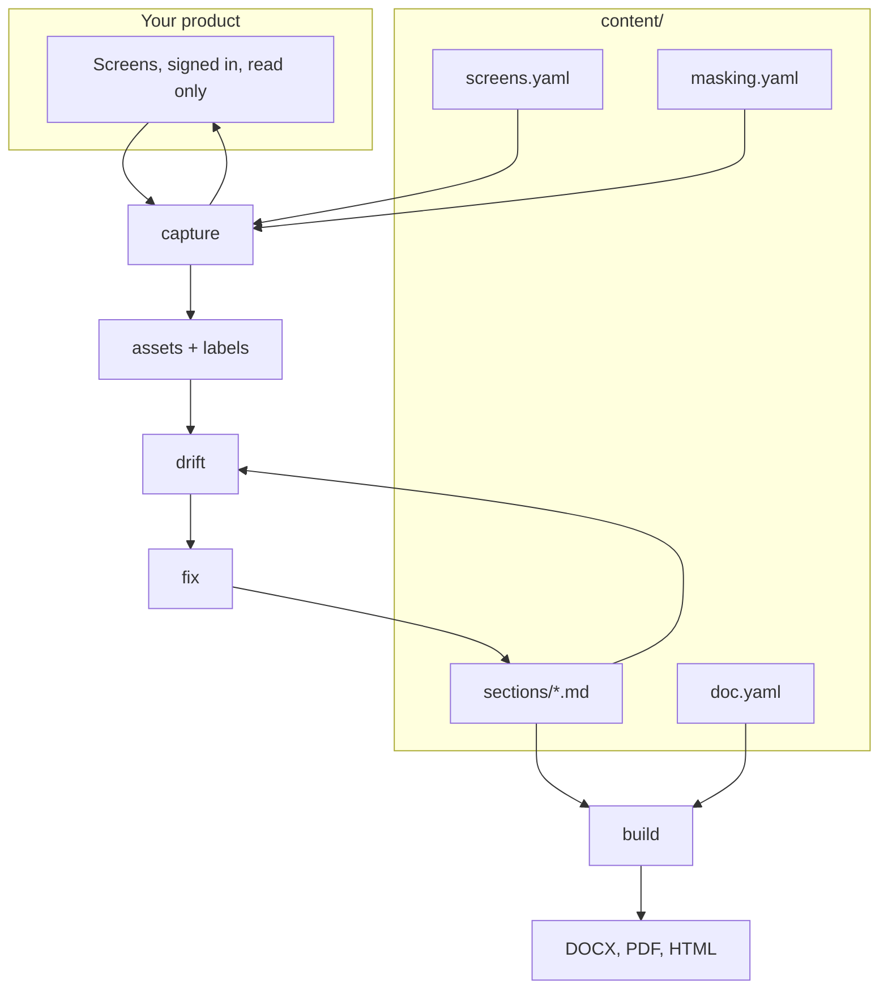

# The Verba wiki

Verba builds technical documentation from the running system rather than from
memory. It signs in, walks every screen, photographs it, reads the labels off
the page, and holds all of that against what your document claims. Most of what
it finds it fixes on its own. What is left comes back as a decision, with the
reason.

This wiki is the long form. The [README](https://github.com/GiladBronshtein/verba)
is the short one.

### Start here

| | |
|---|---|
| [Installation](Installation) | Python, Chromium, and the optional writing extra |
| [Your first document](Your-first-document) | `verba new`, and a PDF within two minutes |
| [The loop](The-loop) | What runs, in what order, and what it refuses to decide |
| [Console guide](Console-guide) | Every page of the management interface |

### The project

| | |
|---|---|
| [Project layout](Project-layout) | What each file under `content/` is for |
| [Sections](Sections) | Front matter, figures, block syntax, numbering |
| [Screens registry](Screens-registry) | How a screen is reached and what is read off it |
| [Connections and sign in](Connections-and-sign-in) | Environments, passwords, single sign on |
| [Masking and names](Masking-and-names) | Keeping customers out of your screenshots |
| [Editions](Editions) | One tree, several documents |
| [Themes and layout](Themes-and-layout) | Palette, typeface, sheet, margins |

### The moving parts

| | |
|---|---|
| [The writer](The-writer) | Models, keys, gateways, house rules |
| [The read only guarantee](The-read-only-guarantee) | Why nothing can be written to your system |
| [Healing selectors](Healing-selectors) | When the page changes underneath a crawl |
| [Rule reference](Rule-reference) | Every rule, what trips it, what clears it |
| [CLI reference](CLI-reference) | Every command and flag |
| [Architecture](Architecture) | Modules, data flow, where state lives |

### When something is wrong

| | |
|---|---|
| [Troubleshooting](Troubleshooting) | Sign in, capture, build, model, console |
| [FAQ](FAQ) | The questions that come up first |
| [Contributing](Contributing) | Two rules that are not style preferences |

---

### The shape of it in one diagram

