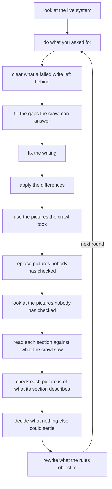

# The loop

Two commands run it.

```bash
verba fix          # settle everything the system can, using the last capture
verba fix --full   # photograph every screen first, then do that
verba auto         # the same loop, with crawling decided per round
```

Everything the console's **Fix what can be fixed** button does, these do. There
is one implementation, driven by both, so the button and the command can never
disagree.

## What runs, in order

Each step is applied, then the rules are counted again. Anything that made the
document worse is put straight back before the next step begins.



| Step | What it does | Needs a model |
|---|---|---|
| look at the live system | Crawls the screens that would answer an open question. `--full` photographs everything instead | no |
| do what you asked for | Applies notes left with `verba note` or in the console | sometimes |
| clear what a failed write left behind | Removes half written state from an interrupted run, so the round starts clean | no |
| fill the gaps the crawl can answer | Writes missing field and control descriptions from evidence, and offers to remove things that were never controls | yes |
| fix the writing | Runs the house style pass across the whole document as one decision | yes |
| apply the differences | Applies drift the crawl proved: renames, additions, removals | no |
| use the pictures the crawl took | Adopts a fresher photograph of a screen a section already shows | no |
| replace pictures nobody has checked | A picture that no crawl produced cannot be trusted. If a screen can produce it, photograph it | no |
| look at the pictures nobody has checked | Reads each unchecked image, against the exact list of names that must never appear | yes, with vision |
| read each section against what the crawl saw | Does what this section says survive contact with the screen, and does it leave out what the screen is for | yes |
| check each picture is of what its section describes | A chapter called Dashboard Overview illustrated by the accounts list passes every other rule | yes, with vision |
| decide what nothing else could settle | From a closed menu of three moves, or says plainly that this one is yours | yes |
| rewrite what the rules object to | The findings that name a rewrite as their fix | yes |

## Measure and revert

Every step is a proposal. The rules are counted before and after, and a step
that raises the count is reverted. This is what makes the loop safe to run
unattended: the worst case is that nothing changed.

Counting alone is not enough, because some damage does not raise an error
count. A whole section rewrite that quietly drops half the figures reads as an
improvement to a counter. So every path that rewrites a whole section is also
held to this:

```python
def _keeps_every_figure(before: str, after: str) -> bool:
    return set(_figures_of(before)) <= set(_figures_of(after))
```

A model asked about labels is not being asked whether the section should have
pictures. This guard exists because that failure actually happened here: five
sections lost fourteen figures in one run, one of them going from thirteen
figures to two, and every one of those rewrites looked like an improvement to a
counter. They were restored from History, and the guard was added to every
rewrite path.

## The decider, and its closed menu

The last step handles what nothing else could. It has exactly three moves:

| Move | When |
|---|---|
| Repoint a figure | The right picture exists under another name |
| Retire a figure | The picture cannot be published and no crawl can replace it |
| Stop capturing | The crawl produces a picture no section shows and none should |
| Accept | A false alarm |
| Hand it back | Anything else |

Nothing else is available to it, so it cannot invent an option under pressure.
The menu is also the thing to check when a finding will not clear: a decider
with no move that fits says "left for a person" every round forever, which is
how four unused image crops survived five rounds of being fixed. A retirement is recorded on the asset:

```json
"retired": {"when": "2026-08-22T17:52", "from": "dashboard.overview", "why": "..."}
```

The sweep reads that marker and will not re offer the same figure to the same
section. Before it did, a decider removal and a sweep re addition fought each
other across four rounds of History.

## A rule may only report work that can be done

The loop can settle what a rule asks for. It cannot settle a rule that asks for
something impossible, and three of those kept a list permanently full:

| Rule | Was reporting | Why nothing could clear it |
|---|---|---|
| `ASSET-05` | Every unreferenced picture | Most were legacy imports no screen produces. No crawl replaces them, no step adopts them |
| `ASSET-06` | Any section with a screen and no figure | When the screen's only picture is already shown elsewhere, adopting it makes a duplicate, which is an error |
| `ASSET-07` | Any screen capturing to a name its section does not use | Even when the picture check had already ruled that capture is of a different screen |

The last one was worse than noise. The decider repointed the section at the
capture to clear `ASSET-07`; the picture check looked, saw a different screen,
and took it out again; `ASSET-07` returned. The error count was identical after
every round, so measure-and-revert saw a loop making no changes rather than two
steps undoing each other.

All three now report only what something can act on. Anything else belongs in
Images, which is an inventory, not a queue.

## Why you should not see a "to fix" list

If the loop works, its own debris is not your problem. Findings that the system
can settle are settled and not reported. What reaches you is what a person
owns: a judgement about the document, not a chore.

A finding with nothing to press is a complaint. Every rule that reports to you
carries what would clear it, and whether the system or a person does it. See
the [Rule reference](Rule-reference).

## Running it without a person

```bash
verba capture && verba fix && verba build --pdf
```

Safe on a schedule. Nothing writes to your product, every change is in History
with a diff and a restore, and the build fails rather than shipping a marker
the writer left because the evidence did not support a claim.
