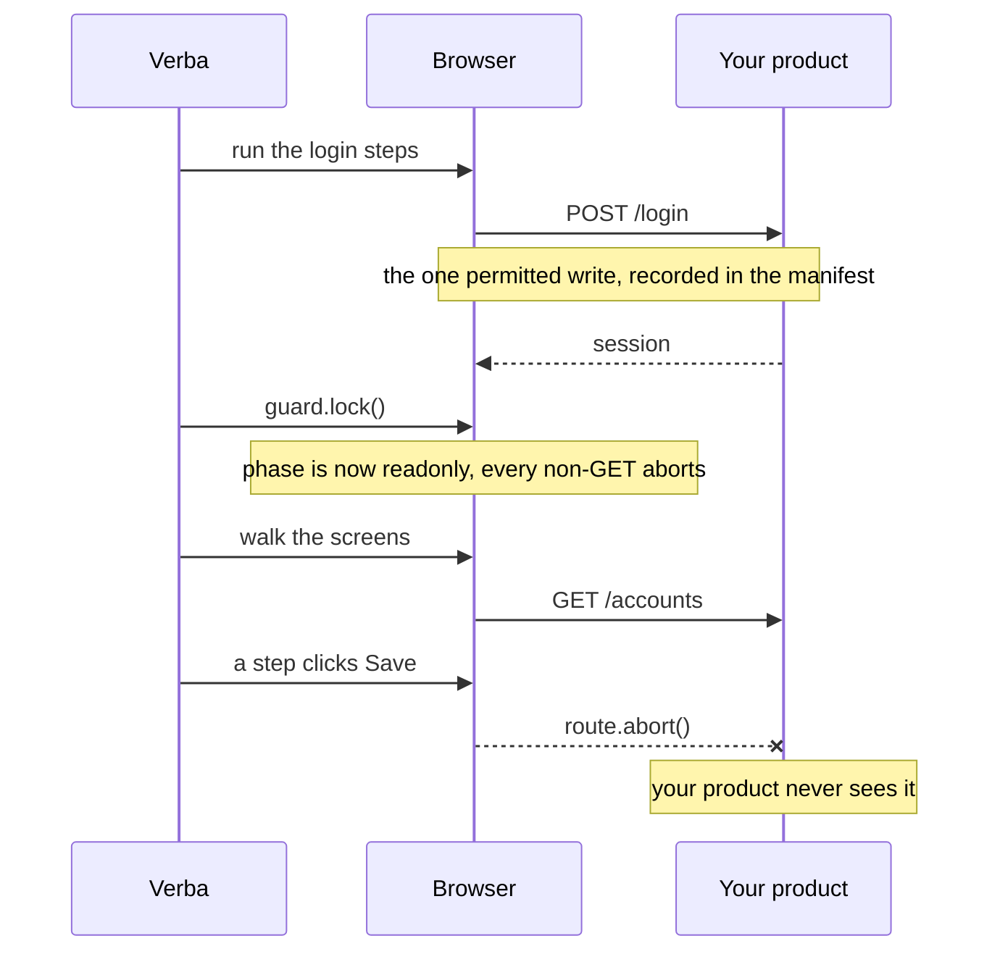

# The read only guarantee

Verba never writes to the system it documents. Not "tries not to": the crawl
runs behind a network guard that aborts every non read request in the browser,
so a misdirected click on Save cannot write, because the request never leaves
the browser.

Everything else in this project depends on that being true, which is why it is
enforced in three layers and verified by a test.



## Layer one: the network guard

```python
READ_METHODS = {"GET", "HEAD", "OPTIONS"}
```

Installed on the page before anything loads. During sign in, writes are allowed,
each one recorded and reported, because signing in is a POST and there is no way
around that. The moment sign in completes the guard is locked, and from then on
every non read request is aborted and logged.

Every crawl leaves a manifest: how many writes were blocked, what they were, and
the full detail of the sign in requests that were permitted. The single
exception stays auditable.

## Layer two: the step interpreter

`fill`, `select`, `check` and `upload` are permitted during sign in only.
Outside it they are refused before the browser opens:

```
step 'fill' types into the page and is only permitted during sign-in.
Remove it from the screen definition.
```

`Enter` and `NumpadEnter` are refused outside sign in too, because a key press
can submit a focused form even when nothing was clicked.

So no form can be completed, which means the guard mostly has nothing to block.

## Layer three: the registry lint

Before a crawl runs, every step is read for controls whose label reads like a
commit: save, submit, delete, remove, archive, duplicate, confirm, apply,
publish, activate, deactivate, disable, enable, pause, resume, update,
overwrite, and creating any named entity.

```
accounts.detail: step clicks 'button.save', which reads like a commit (save).
The network guard will block any write it attempts, but the step should be removed.
```

Advisory, because the guard is what actually prevents the write, and because
some products label a control "Apply filters". Add `opens_form: true` to a step
that opens a form rather than committing one, and the advisory goes away while
the guard stays exactly as it was.

## The test

Not a mock. A real server that records what it receives, a real browser driven
at it with the guard armed, and a button wired to a `PUT`:

```
blocked write: PUT http://127.0.0.1:8899/api/accounts/1
```

The server's write log contained only the sign in POST. The test then removes
the guard and confirms the write **does** get through, so the test is proving
the guard rather than proving that the button was broken.

It runs on every push.

## What this means for you

You can point Verba at production. The worst it can do is read. That is the
whole reason a documentation tool is allowed near a live system at all, and it
is why the guarantee is stated as an absolute rather than a default you can
switch off: there is no flag that disables it, because a flag that disables it
would be the feature that made every other claim here conditional.

If a screen can only be documented by performing a write, that state does not
get documented. Say so, and let a person decide.
